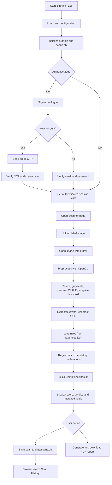
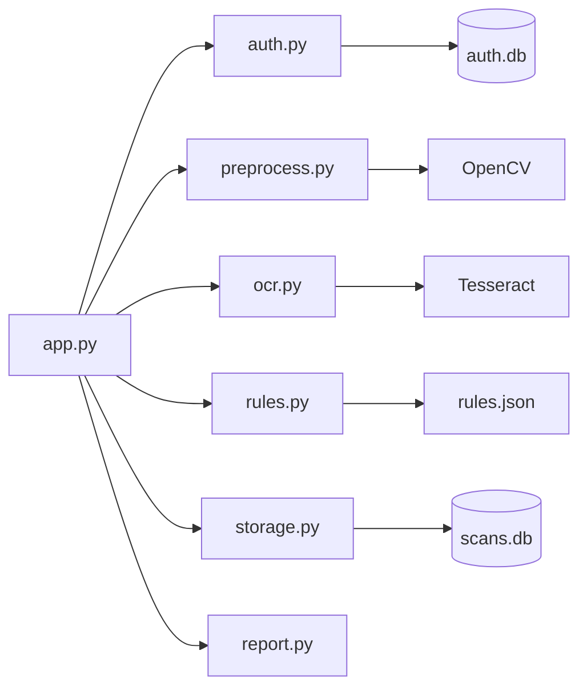

# Label Lens - Legal Metrology Compliance Scanner

Label Lens is a Streamlit prototype for checking packaged-product labels against mandatory declarations from the Legal Metrology (Packaged Commodities) Rules, 2011. It accepts a label image, extracts its text, evaluates configured rules, stores scan history, and produces a PDF report.

## Technical workflow



### Scan processing sequence

1. The user enters a product name and uploads a label image.
2. `core/preprocess.py` converts the image to grayscale, reduces noise, enhances contrast, and applies adaptive thresholding.
3. `core/ocr.py` sends the processed image to Tesseract using page segmentation mode 6.
4. `core/rules.py` loads the configured rules and checks each pattern against the OCR text without regard to case.
5. The rule engine returns a `ComplianceResult` containing field-level status, matched text, score, and missing required fields.
6. Streamlit keeps the latest result in session state so it can be displayed and used by the save/report actions.
7. `core/storage.py` optionally persists the result and OCR text in SQLite.
8. `core/report.py` converts the result into a downloadable PDF containing the verdict, score, detected text, and violations.

## Authentication workflow

1. `app.py` loads environment variables and initializes `data/auth.db`.
2. A new user provides a username, email, and password.
3. The application sends a six-digit email OTP. The OTP expires after five minutes and is held as a hash in memory.
4. After OTP verification, the password is stored as a PBKDF2-HMAC-SHA256 hash and the user is created in SQLite.
5. Login normalizes the email, verifies the password hash, and sets Streamlit session state.
6. Scanner and history pages are available only after authentication.

## Project structure

```
Labal-reader/
├── app.py                # Streamlit UI and application orchestration
├── core/
│   ├── auth.py             # users, password hashing, and email OTP
│   ├── preprocess.py       # image cleanup before OCR (OpenCV)
│   ├── ocr.py              # OCR abstraction (Tesseract by default)
│   ├── rules.py            # JSON-backed compliance rule engine
│   ├── report.py           # PDF report generation
│   └── storage.py          # SQLite scan repository
├── data/
│   └── rules.json          # mandatory declaration definitions
├── requirements.txt
└── README.md
```

Runtime-generated files:

- `data/auth.db` stores user accounts and password hashes.
- `data/scans.db` stores scan history and is created automatically.

### Module dependencies



## Setup

### 1. Install the Tesseract OCR binary (one-time, system-level)

- **Ubuntu/Debian**: `sudo apt-get install tesseract-ocr`
- **macOS**: `brew install tesseract`
- **Windows**: install from https://github.com/UB-Mannheim/tesseract/wiki and add it to your PATH

### 2. Install Python dependencies

```bash
pip install -r requirements.txt
```

### 3. Configure email OTP variables

Create a `.env` file in the project root. Gmail requires an app password when two-factor authentication is enabled:

```env
EMAIL_ADDRESS=your-email@example.com
EMAIL_APP_PASSWORD=your-gmail-app-password
```

The application can start without email configuration, but email OTP signup will not work.

### 4. Run the app

```bash
streamlit run app.py
```

It will open at `http://localhost:8501`.

## Data and configuration

`data/rules.json` controls which declarations are checked. Each rule contains an identifier, display label, description, required flag, and one or more regular-expression patterns. Updating this file changes compliance evaluation without changing Python code.

When a scan is saved, `data/scans.db` stores the product name, timestamp, compliance verdict, score, OCR text, and serialized field results. Scan history can be searched by product name from the Streamlit history page.

## How to test it

Take a clear photo of any packaged product's label (a snack packet,
a shampoo bottle, anything with print on it) and upload it. The OCR
accuracy depends heavily on lighting and focus — flat, well-lit,
close-up shots work best. Try a few different products to see how
the compliance score changes.

## Manual test flow

1. Start the application and create or log into an account.
2. Open **Scanner** from the sidebar.
3. Enter a product name and upload a clear PNG, JPG, JPEG, or WEBP image.
4. Select **Scan Label** and review the OCR text and compliance fields.
5. Select **Save Scan** or **Download PDF Report**.
6. Open **Scan History** and search for the saved product.

## Extending this for the actual SIH submission

- **Better OCR**: swap Tesseract for Google Cloud Vision API in
  `core/ocr.py` (`_extract_with_cloud_vision`, already stubbed in) —
  much more accurate on glossy/curved packaging, at the cost of needing
  an API key.
- **Font-size / readability check**: `core/preprocess.py` has a starter
  function `estimate_text_heights_mm()` that measures character heights
  from contours — wire this into the rules engine as an additional
  compliance check once you've studied the exact font-size clauses in
  the Rules.
- **Role-based access**: add `streamlit-authenticator` for a login
  screen with officer/supervisor/admin roles.
- **Bulk/e-commerce scanning**: add a batch-upload mode and a scheduled
  scraper that feeds listing images through the same `core/` pipeline.
- **Move off Streamlit**: once the `core/` logic is solid, everything
  in this folder can be reused behind a FastAPI backend with a React
  frontend — none of `core/` needs to change, only `app.py` gets
  replaced by API routes + a separate frontend.

## Known limitations (be upfront about these to judges)

- Regex-based field matching is simple and will miss unusual phrasing
  or highly stylised fonts — a production system would need NLP-based
  field classification.
- Tesseract struggles with curved, glossy, or low-contrast labels more
  than commercial OCR services.
- The font-size/readability check is not yet wired into the compliance
  score — it's scaffolded in `preprocess.py` for you to complete..
